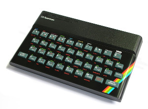
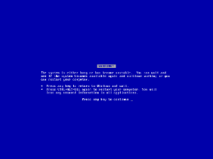
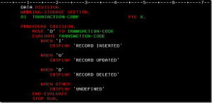
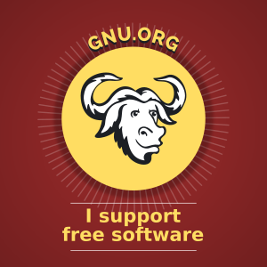

# Carta de presentación
---

Hola, mi nombre es *Iñaki García* y, en esta presentación trataré de concentrar mi trayectoria profesional.

---

Estudié en el *colegio inglés San Jorge* hasta 1º de BUP, terminé el bachillerato en el *instituto Peñaflorida*.

---

Obtuve el título de FPII en *Técnico especialista en informática de gestión*.

---

Mi afición por la informática viene de lejos ...

---

Años más tarde me hice con un *286* y tomé contacto con el *MS-DOS* y *M$*.

y en cierto modo perdí la ilusión por la informática.

---

Durante mis estudios de FP realizé una aplicación de *gestión de morosos* para una asociación de empresas y otra de *gestión de socios* para una sociedad gastronómica. Las dos en *COBOL*.

---

Entré a trabajar como administrativo en una empresa de construcción.

---

Con la llegada de la internet descrubí el *sofware libre*

y recuperé la ilusión por la informática.

---

Con los conocimiento adquiridos gracias al sofware libre y a la inmensidad de recursos disponibles en la internet, monté un *CMS* basado en *Drupal* que conectaba con la aplicación de gestión implantada en la empresa. En ese momento, empecé a aprender *HTML*, *CSS*, *Javascript* y *PHP*

También desarrollé diversos *scripts*, en *Ruby*, que solucionaban algunas carencias que teniamos en el departamento de administración.

---

Después de 17 años, con la llegada de la crisis, emprendí mi carrera como *autónomo* en el mundo del *diseño web*.

---

Tras varios años, con aciertos y tropiezos, he aprendido que el *diseño web* es bastante más que codificar los documentos en *HTML*.

---

La mayoría de los proyectos los he realizado con *Drupal* pero el mantenimiento de un *CMS* llega a ser una ardua tarea al entrar en juego la base de datos, las actualizaciones de los módulos, etc.

---

Ahora los proyectos intento realizarlos siguiendo la arquitectura [JAMStack](https://jamstack.org), y de esta manera dejar atrás los *CMS*.

---

He empezado a abordar los proyectos intentando seguir el siguiente proceso:

- Reserch
- Content Strategy
- Code

---

Algunas de las herramientas que suelo utilizar son:

- Linux Mint
- Atom/Vim
- Firefox/Chrome
- Gimp, Inkscape
- Jekyll
- Gulp
- Git/Github

por nombrar algunas, siempre estoy aprendiendo nuevas.

---

Si no estoy trabajando en algún proyecto, me encantar ver los vídeos de ["The Coding Train"](https://www.youtube.com/channel/UCvjgXvBlbQiydffZU7m1_aw).

---

Muchas Gracias por haberme dedicado este tiempo.

Web: [Txorua Web Design](https://www.txorua.com)
Email: inaki@txorua.com
twitter: @igarbla
